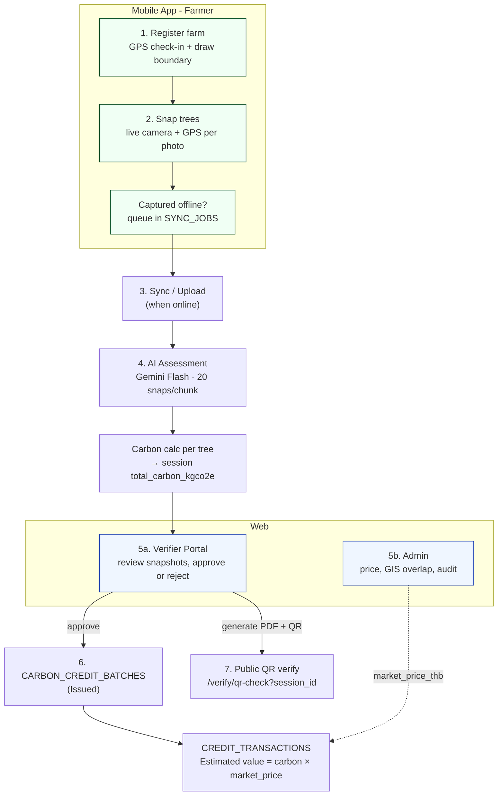
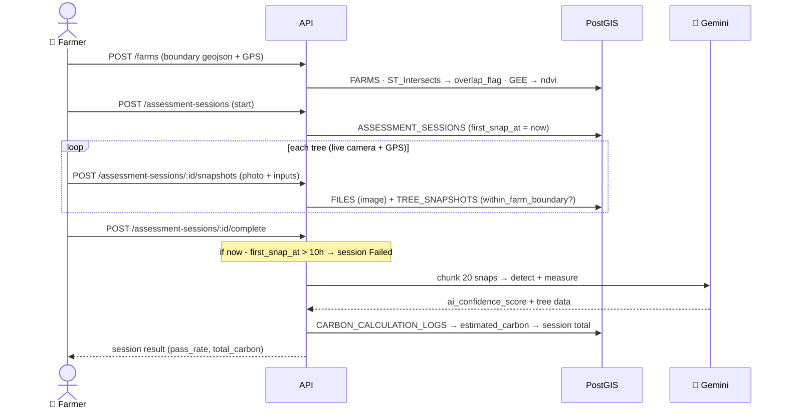

# FarmFlow — Data Flow & Pipeline

| | |
|---|---|
| **Version** | v1.0 |
| **Date** | 2026-06-10 |
| **Status** | Draft — for the API / Mobile team |
| **Companion to** | `FarmFlow-API-Requirements-v1.0.md` (endpoint contracts) · `FarmFlowApp-ERDiagram-v3.md` (schema) |
| **Purpose** | Show **how data flows end-to-end** — especially the **producer side (Mobile / farmer)** that the API Requirements doc does not cover. Use it to understand who creates what, in what order, and which rules apply at each step. |

> The API Requirements doc covers the **consumer side** (Admin + Verifier reading data).
> This doc covers the **producer side** (Mobile capture → AI → the carbon pipeline) and
> ties the whole thing together. If the data flow is unclear, **start here**.

---

## 1. Big picture — the carbon pipeline

**One-line summary:** the **Mobile app produces** the raw data (farm boundary + tree photos), **AI scores it**, the **Verifier (web) approves it**, and that becomes a **carbon credit** with a **publicly verifiable document**.

---

## 2. Actors & surfaces

| Surface | Who | Role in the flow |
|---|---|---|
| 📱 **Mobile App** (Flutter) | Farmer | **Produces** data: farm boundary, tree photos (Snap), offline sync |
| ☁️ **API** (Bun/Elysia + PostGIS) | — | Stores, runs overlap/GEE checks, calls AI, computes carbon |
| 🤖 **Gemini Flash** | — | Tree detection + `ai_confidence_score` from photo chunks |
| 💻 **Web · Verifier Portal** | External verifier | **Reviews & approves** assessments → issues credit + document |
| 💻 **Web · Admin Dashboard** | Internal admin | Farmers, GIS overlap resolution, market price, audit, announcements |
| 🌐 **Public** | Anyone | Scans QR → verifies a document's `session_id` (no PII) |

---

## 3. Stage-by-stage (the heart of this doc)

Legend — endpoint status: ✅ exists today · ❌ to build · ⚠️ partial.

### Stage 1 — Register a farm  *(Mobile)*
- **Action:** farmer does a **GPS check-in** (no manual coords) and **draws the boundary** → `farm_polygon_geojson`; declares area; sets species/density per zone.
- **Writes:** `FARMS` (status `Draft`→`Pending`), `FARM_AGRICULTURAL_DATA`, optional `SUBPLOTS` (zones), cover photo → `FILES`.
- **Server rules (run here):**
  - PostGIS `ST_Intersects` vs other farms → `overlap_validation_flag` (overlap > 15%).
  - `|declared − calculated| > 15%` → `area_discrepancy_flag`.
  - Google Earth Engine NDVI → `gee_verification_result` (is this really vegetation?).
- **Endpoints:** `POST /farms` ✅ · `POST /farms/:id/agricultural-data` ✅ · `POST /farms/:id/cover-photo` ✅
  *(Boundary draw + subplot subdivision is a Mobile capability — see Data Flow note below.)*

### Stage 2 — Snap trees  *(Mobile)*
- **Action:** farmer opens an **assessment session** and photographs each tree with the **live camera** (gallery blocked); each photo carries **GPS** (`capture_lat/lng`) and must be **within 27 m** of the boundary.
- **Writes:** `ASSESSMENT_SESSIONS` (sets `first_snap_at`), one `TREE_SNAPSHOTS` + one `FILES` (image) per photo. Snapshot stores **inputs** (circumference, height, weather) + `within_farm_boundary`.
- **Endpoints:** `POST /assessment-sessions` (start) ✅ · `POST /assessment-sessions/:id/snapshots` (capture, photo multipart) ✅ · `GET /assessment-sessions/:id/snapshots` ✅

### Stage 3 — Offline sync
- **Action:** photos taken offline sit in a **`SYNC_JOBS`** queue on-device; uploaded when back online.
- **Rule:** **10-hour deadline** from `first_snap_at`. Past 10 h → `sync_status = Failed` and the session is **rejected** (anti-backdating).
- **Endpoints:** uses the Stage-2 endpoints once online. (Queue lives on the device; `SYNC_JOBS` mirrors status server-side.)

### Stage 4 — AI assessment
- **Action:** on **session complete**, snapshots are **chunked (20/chunk) → Gemini Flash** for tree detection + measurement + `ai_confidence_score`.
- **Carbon math (per tree):** `DBH = circumference ÷ π → D²H → allometric (SPECIES_EQUATIONS) → bTREE → cTREE → CO₂e`. Intermediates → `CARBON_CALCULATION_LOGS`; final per tree → `TREE_SNAPSHOTS.estimated_carbon_kgco2e`; aggregate → `ASSESSMENT_SESSIONS.total_carbon_kgco2e`.
- **Pass rule:** `session_pass_rate ≥ 90%` (≤ 10 % false tolerance) = session passes.
- **Endpoints:** `POST /assessment-sessions/:id/complete` ✅ (should trigger/queue the AI run) · AI status on the session (`ai_batch_status`).

### Stage 5 — Review & govern  *(Web)*
- **Verifier (Verifier Portal):** reviews the batch — per-tree confidence, **GPS-in-boundary cross-check**, metadata — then **Approve** (→ `ASSESSMENT_RESULTS`, issues batch + document) or **Reject** (`ai_rejection_reason` **required**, farmer re-surveys only the flagged area). ❌ to build — see API Requirements §5.
- **Admin (Dashboard):** resolves GIS **overlap disputes**, sets **`market_price_thb`** (`CARBON_MARKET_CONFIG`), reviews **audit log**, manages farmers/admins/announcements. ❌ to build — see API Requirements §4.

### Stage 6 — Credit issuance + value
- **Action:** an approved result → **`CARBON_CREDIT_BATCHES`** (`status` Pending→Issued→Sold→Retired) → **`CREDIT_TRANSACTIONS`**.
- **Value:** `Estimated value (THB) = total_carbon_kgco2e / 1000 × market_price_thb` (price is per **tCO₂e**). Admin governs the price; everyone reads the same value.

### Stage 7 — Public verification
- **Action:** the approved document's PDF carries a **QR → `/verify/qr-check?session_id=...`**. The public endpoint returns **validity + issue date only — no PII**. ❌ to build — see API Requirements §5.6.

### Cross-cutting (run throughout)
- **`NOTIFICATIONS`** — push to farmer on approve/reject/market events. **`AUDIT_LOGS`** — every admin/verifier write. **`STATUS_HISTORIES`** — farm/session status changes. **`SURVEY_STREAKS`** — gamification when enough trees pass.

---

## 4. Capture → assessment (sequence)

---

## 5. Status lifecycles (state machines)

| Entity | Field | States |
|---|---|---|
| Farm | `farm_status` | `Draft → Pending → Active` (or `Rejected` / `Suspended`) |
| Session (sync) | `sync_status` | `Pending_Local → Uploading → Synced` (or `Failed` @ 10h) |
| Session (AI) | `ai_batch_status` | `Waiting → Processing → Completed` (or `Rejected`) |
| Snapshot | `ai_assessment_status` | `Waiting → Completed` (or `Rejected`) |
| Credit batch | `status` | `Pending → Issued → Sold → Retired` |
| Verifier review¹ | (review status) | `Pending → Approved` / `Rejected` |

¹ Review status is the verifier-portal concept (distinct from the credit lifecycle) — see API Requirements §5.

---

## 6. Mobile / Farmer-side API — what exists vs. needed

These are the **producer endpoints** (not in the API Requirements doc, which is admin/verifier only).

| Flow step | Endpoint | Status |
|---|---|---|
| Farmer auth (SSO / login) | `/auth/*` | ✅ exists |
| Create / list / update farm | `POST /farms`, `GET /farms`, `PUT /farms/:id` | ✅ exists |
| Farm boundary (`farm_polygon_geojson`) | in the farm create/update body | ⚠️ confirm the field is accepted + validated (PostGIS) |
| Subplots (zone subdivision) | `SUBPLOTS` CRUD | ❌ to build (when Mobile adds subplot drawing) |
| Agricultural data (species/density) | `POST /farms/:id/agricultural-data` | ✅ exists |
| Start session | `POST /assessment-sessions` | ✅ exists |
| Capture snapshot (photo + GPS + inputs) | `POST /assessment-sessions/:id/snapshots` | ✅ exists |
| Complete session → trigger AI | `POST /assessment-sessions/:id/complete` | ✅ exists — ⚠️ confirm it queues the Gemini run + writes carbon |
| File download | `GET /files/:id`, `GET /files/:id/content` | ✅ exists (private to uploader) |
| Push notifications | `PUSH_TOKENS` / `NOTIFICATIONS` | ⚠️ partial |

> **Takeaway for the API dev:** the **capture endpoints already exist**; the gaps are (a) confirming boundary/subplot geometry handling, (b) the AI-assessment trigger + carbon write on `complete`, and (c) the **entire verifier/admin consumer side** (API Requirements §4–5).

---

## 7. Current build reality (2026-06-10)

| Layer | State |
|---|---|
| **Web (Admin + Verifier)** | ✅ built (BETA), fully **mocked** behind data seams — ready to swap to real API |
| **API** | ✅ farmer-side (auth, farms, assessment-sessions, files) · ❌ admin-data + verifier endpoints |
| **Mobile (Flutter)** | 🚧 in progress (boundary draw not yet) — capture flow is the critical path |
| **DB seed** | users 6 · farms 6 · sessions 56 · snapshots 19 · files 19 · **results 0 · credit_batches 0** · roles = only `MASTER` |

→ **Critical path = Mobile capture** (it feeds everything). The web/verifier review layer waits on results/batches existing, which waits on capture + AI. Build order: confirm capture+AI write carbon → verifier endpoints → credit/QR.

---

*Companion docs: `FarmFlow-API-Requirements-v1.0.md` (contracts), `FarmFlow-API-v1.0.openapi.yaml` (machine-readable), `FarmFlowApp-ERDiagram-v3.md` (schema).*
